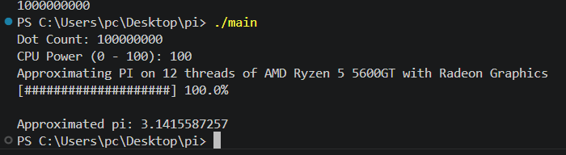

# Monte Carlo Pi Approximation

Welcome! This project uses a multithreaded Monte Carlo simulation to approximate the value of π (Pi) using C++.

---

## How To Run

```bash
g++ main.cpp -o main
./main.exe
```

> **Note:** The above is for Windows. Use the appropriate compiler and command for your OS.

---

## Features

- Multithreaded computation for faster results
- Adjustable dot count for accuracy
- Adjustable CPU power usage
- Real-time progress bar

---

## Screenshot

<div align="center">
	
</div>

---

## License

MIT
